# Book Data Analysis README

## Introduction
This document summarizes the analysis conducted on a dataset comprising 10,000 books, focusing on various attributes including ratings, publication years, and author information. The analysis aims to uncover patterns, correlations, anomalies, and potential insights that can drive better decision-making in the book industry.

## Data Summary
The dataset included crucial fields such as `book_id`, `goodreads_book_id`, `authors`, `average_rating`, and several ratings categories (1-5). Below are key descriptive statistics from the dataset:

- **Book Count:** 10,000 records present.
- **Average Rating:** The mean rating is approximately 4.00 with a standard deviation of 0.25, indicating a generally favorable reception.
- **Authors:** There are 4,664 unique authors, with Stephen King being the most frequently cited author (60 occurrences).
- **Original Publication Year:** The average year is around 1982, and the data spans from as early as 1750 to 2017.

### Missing Values
No missing values were detected across the dataset, indicating a high quality of the collected data.

## Correlation Analysis
A correlation matrix was calculated, revealing interesting relationships:
- **Ratings Count:** Shows a strong negative correlation (-0.37) with `work_text_reviews_count`, suggesting that books with more ratings might not receive as many written reviews, which could imply either reader preference for quick ratings or lack of engagement for popular titles.
- **Books Count vs. Ratings:** Books with a higher count in the dataset show a weak negative correlation with average ratings, hinting that perhaps more popular or prolific authors tend to attract varied opinions.

## Outlier Detection
The analysis identified outliers in ratings, with 9500 cases classified as "normal" and 500 identified as potential anomalies. These outliers could be due to:
- Exceptional popularity or garnering attention (positive or negative).
- Data entry errors or unusual ratings behavior.

## Clustering Analysis
Clustering analysis categorized the dataset into three clusters:
- **Cluster 1 (Majority):** 7,374 entries, likely indicating books renowned for higher ratings.
- **Cluster 0 (Moderate):** 2,544 entries, possibly representing average or mixed reviews.
- **Cluster 2 (Minority):** 82 entries, potentially niche or less-recognized works.

The centroids provide insights into the characteristics of each cluster, which can inform business strategies such as targeting marketing campaigns or tailoring recommendations.

## Anomalies and Surprising Patterns
Notable anomalies were detected in the average ratings and ratings counts related to specific authors and book IDs. Further examination of these clusters may unveil surprising patterns that could shape marketing strategies further.

## Recommendations for Future Analysis
- **Further Analysis on Clusters:** The characteristics of identified clusters warrant additional analysis to determine what factors contribute to a book being placed in a certain category.
- **Data Enhancements:** Incorporating more variables such as genre, book length, or sales data could yield deeper insights.
- **Sentiment Analysis on Reviews:** Evaluate text reviews to identify themes or sentiments driving ratings, which might be pivotal for marketing or development purposes.

## Potential Business Insights
Through this analysis, we can derive several potential business decisions:
- **Targeted Marketing Campaigns:** Focusing on books within specific clusters can enhance conversion rates.
- **Author Spotlighting:** Leveraging popular authors or unique titles in marketing materials can attract more reader engagement.

## Conclusion
The comprehensive analysis of the dataset offers valuable insights into the world of books and reader preferences. By addressing the characteristics of various clusters, addressing anomalies, and suggesting future exploration paths, data-driven decision-making in the book market can be significantly enhanced.

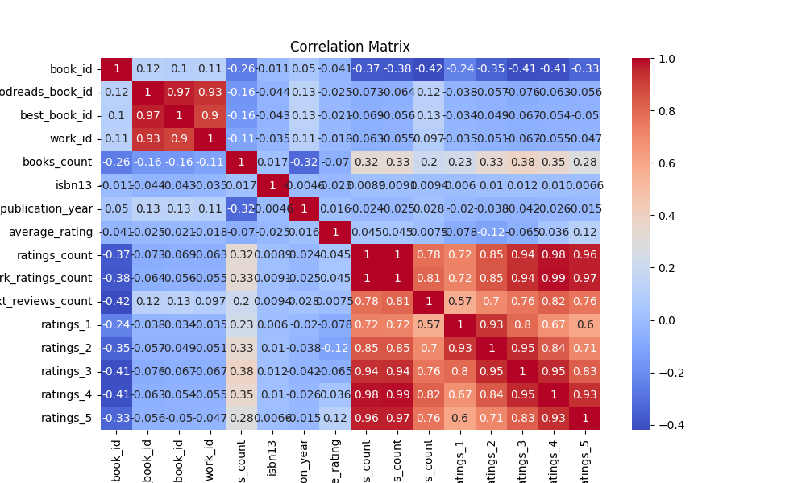
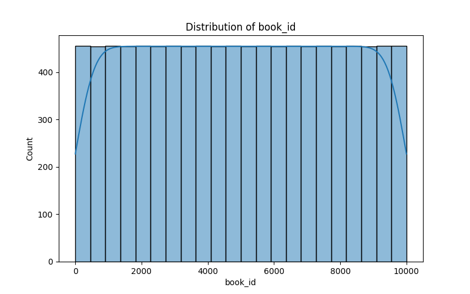
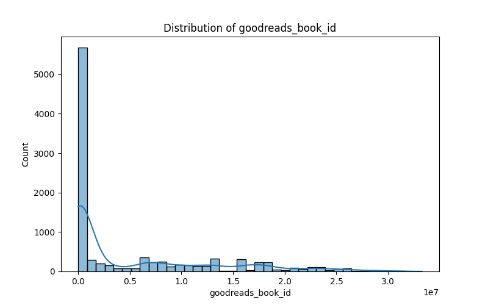

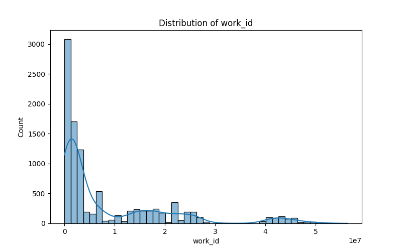
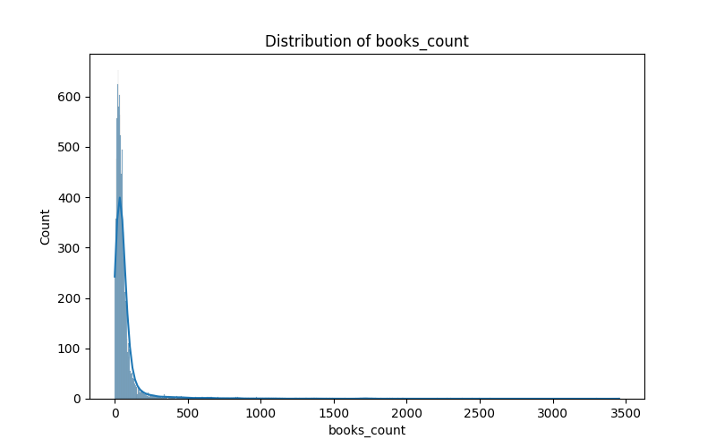
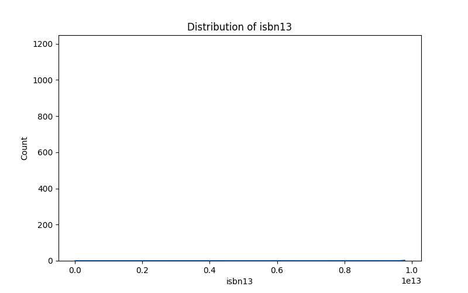
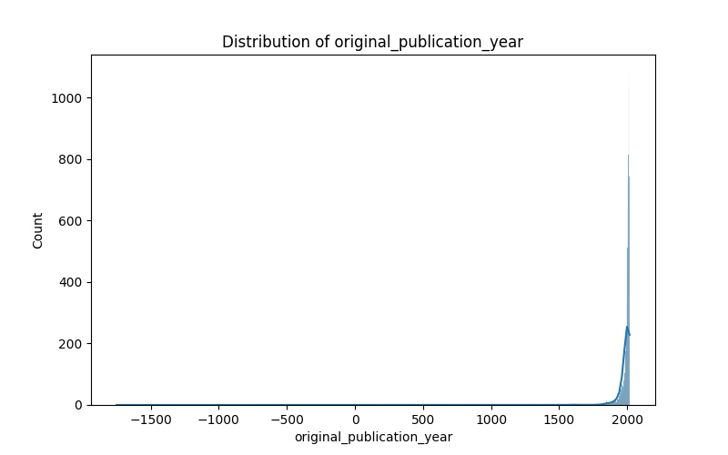
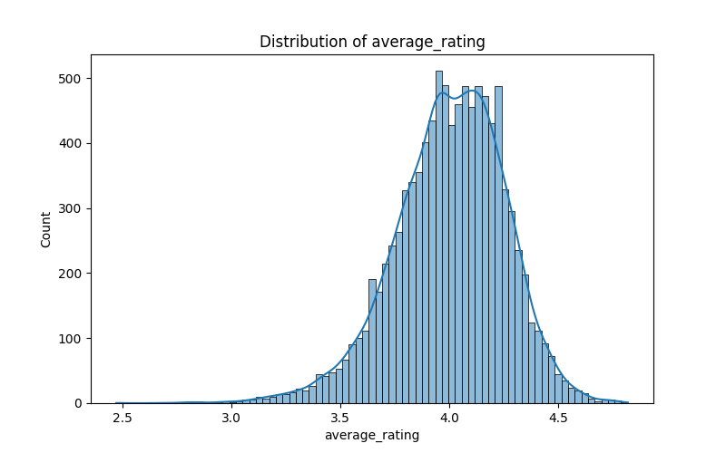
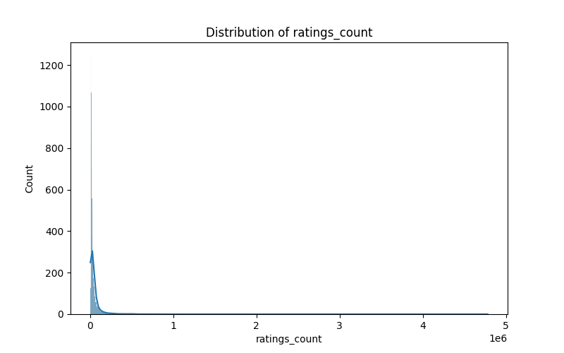
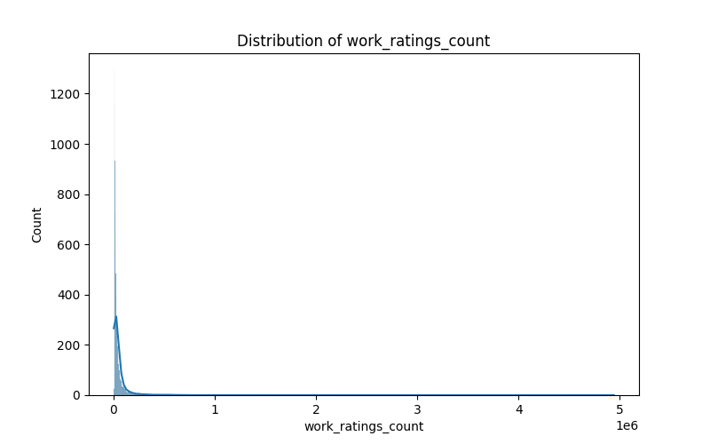
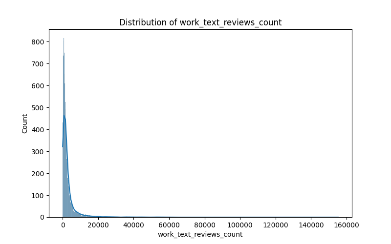
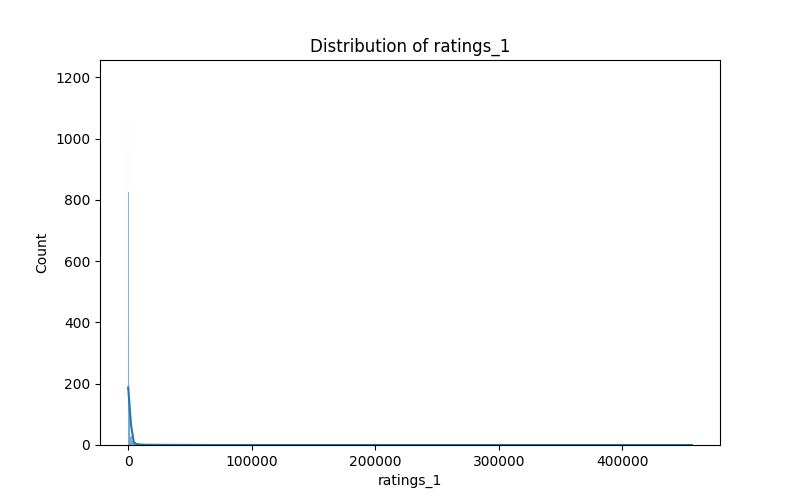
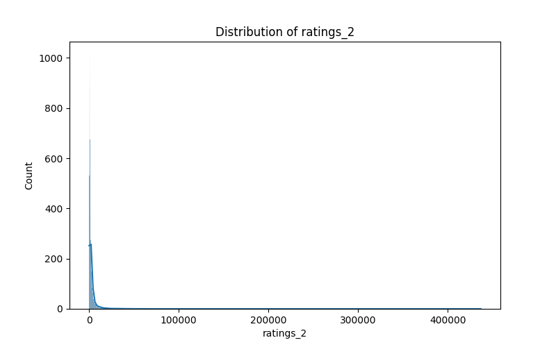
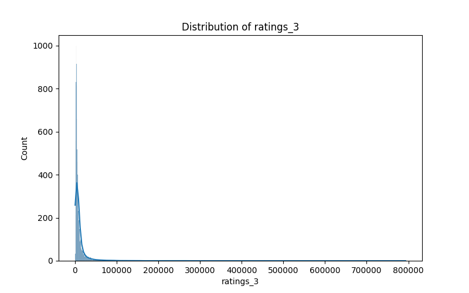
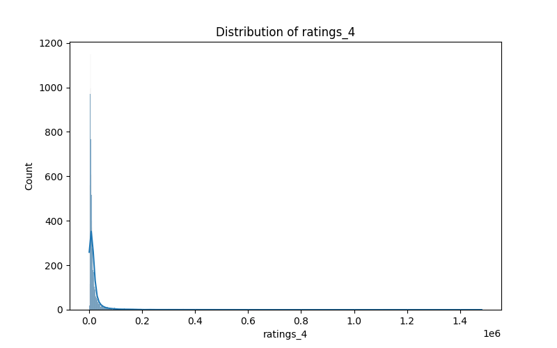
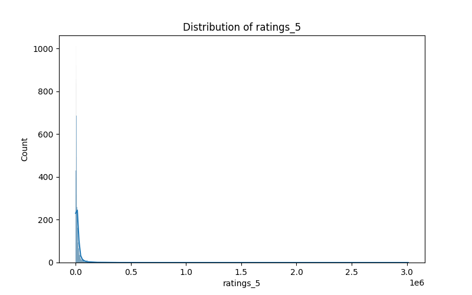 

This README serves as a detailed guide through the insights gathered from the analysis of book-related data, with practical implications for the book industry.