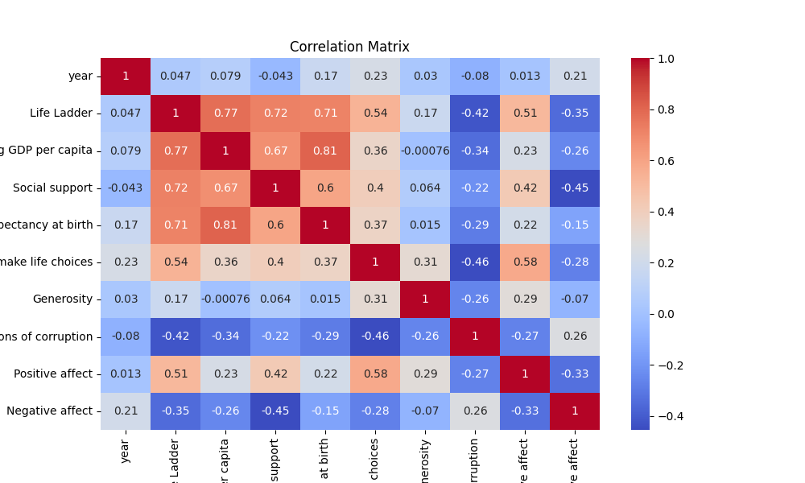

# README.md: Analysis of World Well-Being and Economic Indicators

## Overview

This document provides a comprehensive analysis of a dataset comprising various well-being and economic indicators across different countries and years. The analysis explores key trends, correlations, outliers, and clusters to derive actionable business insights.

## Data Summary

The dataset includes 2,363 entries, representing a rich tapestry of world data from 165 unique countries. Key features include:

- **Country Name:** 2363 entries (Top count: Lebanon with 18 occurrences)
- **Year:** Ranges from 2005 to 2023 (Mean: 2014.76)
- **Life Ladder:** Happiness index with an average of 5.48 (Range: 1.281 to 8.019)
- **Log GDP per Capita:** Economic indicator showing average log GDP of 9.40
- **Social Support:** Average value of 0.81 indicating perceived social relationships
- Additional indicators such as Healthy Life Expectancy, Freedom to make life choices, Generosity, and others are also included.

All columns contain no missing values, indicating a complete dataset ready for analysis.

## Correlation Analysis

The correlation matrix reveals interesting relationships:

- Strong correlations:
  - **Life Ladder and Log GDP per Capita:** (0.78) suggests higher GDP is associated with greater happiness.
  - **Life Ladder and Social Support:** (0.72) indicates that social support significantly impacts the happiness index.
  
- Weak correlations:
  - **Negative Affect:** Shows a weak positive correlation with years (0.21) but negative with Life Ladder (-0.35), suggesting that as time progresses, negative feelings may reduce those perceptions of happiness.

## Outlier Detection

The dataset indicates the presence of outliers:
- **Positive Outliers (1):** 2244 entries
- **Negative Outliers (-1):** 119 entries

These anomalies may represent exceptional cases where certain countries report significantly higher or lower scores on one or more indicators, warranting a deeper investigation.

## Clustering Analysis

Clustering identifies three distinct groups within the dataset:
- **Cluster 1 (1113 countries)**: Typically showcases countries with higher well-being metrics.
- **Cluster 2 (835 countries)**: Represents moderate scores across various indicators.
- **Cluster 0 (415 countries)**: Generally includes nations with lower metrics.

Understanding these clusters can lead to tailored interventions or product offerings that address specific needs identified in each group.

## Key Insights and Business Implications

1. **Trends and Patterns:**
   - A clear trend shows that countries with higher GDP metrics tend to have higher ratings in life satisfaction and social support.
   - Anomalies in negative feelings might point to social or political issues affecting well-being.

2. **Future Analysis Recommendations:**
   - Explore deeper socioeconomic factors contributing to perceived happiness and dissatisfaction.
   - Investigate why Lebanon shows a disproportionately high frequency, possibly due to specific socioeconomic conditions impacting well-being.

3. **Missing Values and Outliers:**
   - Given the absence of missing values, it's important to monitor future data submissions for possible inconsistencies.
   - The causes of outliers could be socio-political events affecting specific countries, which should be examined closely.

4. **Data Quality and Improvements:**
   - The dataset is robust but would benefit from additional qualitative data such as personal narratives or interviews to enrich quantitative findings.
   - Collecting more localized data, such as city-level metrics, could provide nuanced insights.

5. **Implications for Decision-Making:**
   - Organizations can use insights from clusters for targeted marketing. For example, Cluster 1 could be prioritized for premium products, whereas Cluster 0 might benefit from initiatives aimed at social support enhancement.

## Conclusion

This analysis highlights significant relationships and patterns within the dataset, providing a foundation for strategic decision-making and focused interventions. By addressing the identified patterns and recommendations, organizations and policymakers can enhance well-being outcomes in diverse populations.

For further exploration, additional data or qualitative analysis is recommended to supplement these findings.
