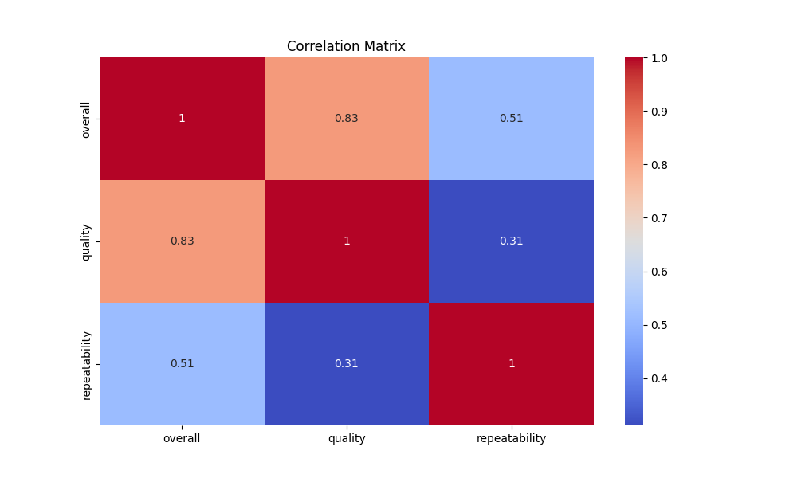

# README.md for Dataset Analysis

## Overview

This document presents a detailed analysis of a dataset containing 2,652 records related to various media types, predominantly movies. The dataset includes attributes such as date, language, type, title, creator, overall scoring, quality rating, and repeatability measures. The analysis highlights potential insights and trends while providing recommendations for future actions based on the findings.

## Data Summary

The characteristics of the data are summarized as follows:

- **Date**
  - Total Records: 2652
  - Unique Dates: 2055
  - Most Frequent Date: 21-May-06 (107 occurrences)
  
- **Language**
  - Total Records: 2652
  - Unique Languages: 11
  - Most Common Language: English (1306 occurrences)
  
- **Type**
  - Total Records: 2652
  - Unique Types: 8
  - Most Common Type: Movie (2211 occurrences)
  
- **Title**
  - Total Records: 2652
  - Unique Titles: 2312
  - Most Frequent Title: Kanda Naal Mudhal (9 occurrences)
  
- **By** (Creator)
  - Total Records: 2652
  - Unique Creators: 1528
  - Most Frequent Creator: Kiefer Sutherland (310 occurrences)

- **Overall Rating**
  - Mean: 3.05
  - Standard Deviation: 0.76
  - Range: 1 to 5

- **Quality Rating**
  - Mean: 3.21
  - Standard Deviation: 0.80
  - Range: 1 to 5

- **Repeatability**
  - Mean: 1.49
  - Standard Deviation: 0.60
  - Range: 1 to 3
  
### Missing Values

There are no missing values in any of the dataset fields. This is an indication of a well-maintained dataset.

## Correlation Analysis

A correlation matrix was constructed to examine relationships among the numeric attributes. Key observations include:

- **Strong Correlation**: There is a strong positive correlation (0.83) between overall rating and quality rating, suggesting that higher quality ratings often coincide with higher overall ratings.
- **Moderate Correlation**: There is a moderate correlation (0.51) between overall rating and repeatability.
- **Weak Correlation**: The correlation between quality rating and repeatability is weak (0.31).

### Correlation Matrix Visualization

## Anomaly Detection

The analysis identified a significant number of outliers: 
- Positive anomalies (1): 2536 occurrences
- Negative anomalies (-1): 116 occurrences

These outliers may reflect ratings that significantly deviate from the norm, potentially indicating extreme satisfaction or dissatisfaction among users.

## Clustering Analysis

The clustering results can be summarized as:
- Cluster Count Frequencies:
  - Cluster 0: 1315 items
  - Cluster 1: 568 items
  - Cluster 2: 769 items
  
  The centroids for each cluster suggest different characteristics in terms of overall rating, quality, and repeatability. Further analysis can delineate distinct audience segments or content types, leading to targeted marketing and content strategies.

### Business Implications
- Focus efforts on content type and targeted marketing that aligns with identified clusters. For example, the largest cluster can be analyzed deeper to cater to user preferences effectively.

## Recommendations

1. **Future Data Collection**: To enhance insights, consider informing the dataset with user demographic information. This could assist in understanding target audiences.
2. **Handling Outliers**: Conduct a deeper dive into the identified outliers to determine causes, whether they stem from genuine user feedback or possible data entry errors.
3. **Quality Improvement**: Since the dataset has no missing values, continue this maintenance practice and regularly validate data integrity.
4. **Additional Metrics**: Future inclusion of metrics such as user demographic details, time spent with each title, or user engagement measures may provide additional insights.

## Summary of Findings

This analysis has uncovered patterns and correlations that present valuable insights into user preferences and content success. The findings can guide marketing strategies and content development, emphasizing quality and overall satisfaction. Assessing and understanding the nuances behind user ratings can significantly inform business decisions moving forward.
