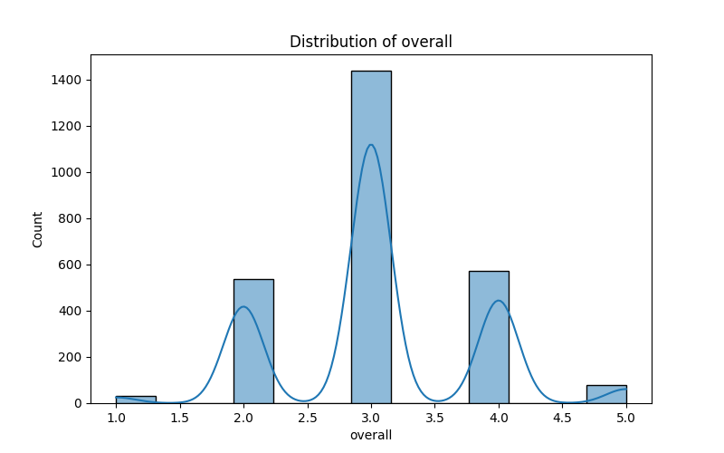
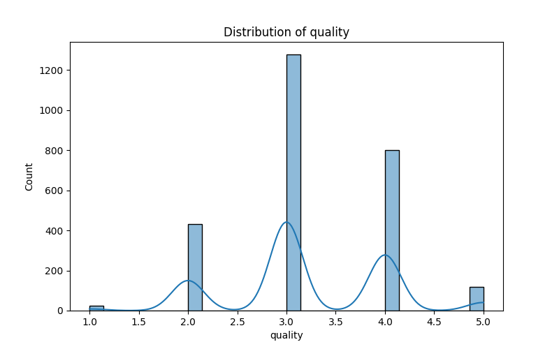
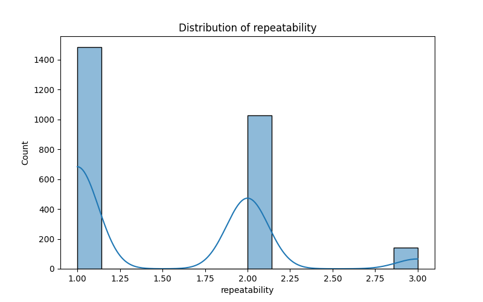

# Analysis README

## Overview

This document presents a comprehensive analysis of a dataset containing 2,652 records related to media content. The dataset consists of several features, including date, language, type, title, author, and ratings related to overall quality and repeatability. This analysis provides insights into patterns, anomalies, correlations, clustering, and recommendations for further analysis.

## Dataset Summary

### Key Features:
- **Date**: 2652 entries, 2055 unique dates. The most frequent date is '21-May-06', appearing 107 times.
- **Language**: 2652 entries, 11 unique languages. The predominant language is English, with 1,306 entries.
- **Type**: 2652 entries, 8 unique types, mostly categorized as movies (2,211 entries).
- **Title**: 2652 entries, 2,312 unique titles. The most common title is 'Kanda Naal Mudhal' with 9 occurrences.
- **Author**: 2652 entries, 1,528 unique authors. 'Kiefer Sutherland' is the most frequently occurring author, mentioned 310 times.
  
### Rating Metrics:
- **Overall Rating**: Mean = 3.05, Std Dev = 0.76. Ratings range from 1 to 5.
- **Quality Rating**: Mean = 3.21, Std Dev = 0.80. Ratings range from 1 to 5.
- **Repeatability**: Mean = 1.49, Std Dev = 0.60. Ratings indicate the frequency of watching or using a specific piece of content.

### Summary of Missing Values:
All fields have zero missing values, indicating a complete dataset for analysis.

## Correlation Analysis

### Correlation Matrix Insights:
- A strong positive correlation exists between **Overall Rating** and **Quality Rating** (0.83), indicating that as the quality rating increases, the overall rating tends to follow.
- A moderate correlation exists between **Overall Rating** and **Repeatability** (0.51), suggesting that more highly rated content may be watched more frequently.
- The weaker correlation between **Quality Rating** and **Repeatability** (0.31) implies that quality does not strongly influence how often content is revisited.

## Outlier Detection

Outliers were detected with a significant skew towards positive ratings:
- **Positive Outliers** (1): 2,536 occurrences
- **Negative Outliers** (-1): 116 occurrences

The large disparity indicates that the majority of the ratings are clustered around the higher values, while a minority reported lower satisfaction, which warrants further exploration.

## Clustering Analysis

### Clusters Identified:
1. **Cluster 0**: 1,315 entries
2. **Cluster 1**: 568 entries
3. **Cluster 2**: 769 entries

### Centroids:
- Overall: [-0.064, -1.444, 1.177]
- Quality: [-0.086, -1.268, 1.084]
- Repeatability: [-0.171, -0.700, 0.810]

### Implications of Clusters:
- The identified clusters can assist in tailoring marketing efforts: 
  - **Cluster 0** can be targeted with promotional offers for products similar to their previously favored content. 
  - **Clusters 1 and 2** might indicate niche markets that require personalized marketing strategies based on their unique preferences.

## Recommendations for Future Analysis

1. **Handling Outliers**: Review the outlier cases to determine whether they are indicative of genuine user sentiment or erroneous entries.
   
2. **Further Data Collection**: Including user demographics, viewing habits, or content genres could enrich the dataset and yield deeper insights.

3. **Exploring Additional Analytics**: Investigate the impact of external factors (e.g., marketing campaigns) on the ratings to identify correlations with spikes in overall or quality ratings.

4. **Qualitative Feedback**: Consider integrating qualitative data from user reviews to complement the quantitative data for a holistic view.

## Conclusion

This analysis reveals significant trends and patterns in how media content is rated across various characteristics, particularly highlighting the high quality and overall ratings in the dataset. The consistency across the majority of records and the detection of clusters suggest opportunities for strategic decisions in content promotion and user engagement. Future efforts should aim to expand the dataset and analyze additional features to develop a more comprehensive understanding of user preferences and behaviors.

## Attached Visuals

- 
- 
- 
- 